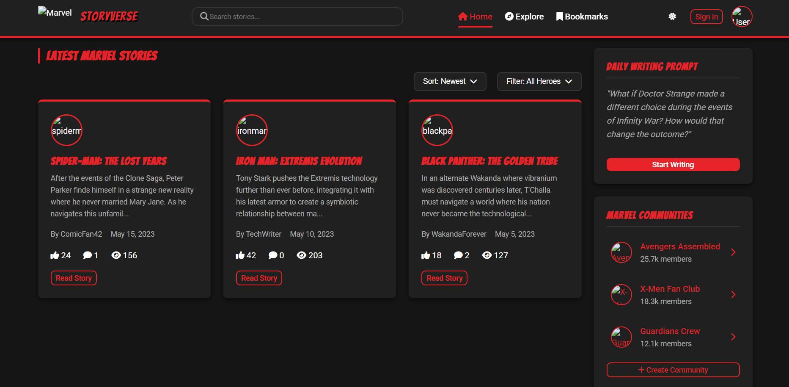

# Marvel StoryVerse 🦸‍♂️📝  
*A Collaborative Superhero Storytelling Platform for Marvel Fans*



## 🚀 Overview
**Marvel StoryVerse** is a fan-powered platform where Marvel enthusiasts unite to create, share, and engage with original superhero stories. Whether you're a casual fan or a hardcore comic buff, this project gives you the tools to dive into imaginative storytelling and community interaction.

> ⚠️ This is a non-commercial fan-made project and is not affiliated with Marvel or Disney.

---

## 📚 Features

### 👥 User Features
- **Secure Authentication** with avatar selection  
- **Story Creation** with a rich text editor and live preview  
- **Story Browsing** by character, popularity, tags, and more  
- **Voting & Comments** for reader engagement  
- **Bookmarks** to save stories for later  
- **Responsive Design** for all device types  

### ⚙️ Advanced Capabilities
- **Multi-Chapter Series** support  
- **Draft Mode** to save works-in-progress  
- **Dark/Light Theme Toggle**  
- **Toast Notifications** for real-time feedback  
- **Loading Skeletons** for a smooth UX  

---

## 🛠️ Tech Stack

### Frontend
- **HTML5** – Semantic structure  
- **CSS3** – Flexbox, Grid, animations, custom properties  
- **JavaScript (ES6+)** – Modular and interactive scripting  
- **Font Awesome** – Icons  
- **Google Fonts** – *Bangers* (headings) and *Roboto* (text)  

### Dev Tools
- **VS Code** – Main development environment  
- **Git** – Version control  
- **Chrome DevTools** – Debugging and testing  

---

## 🧑‍💻 Installation

### Step 1: Clone the Repository
```bash
git clone https://github.com/rn-swain/Marvel-StoryVerse.git
cd Marvel-StoryVerse
